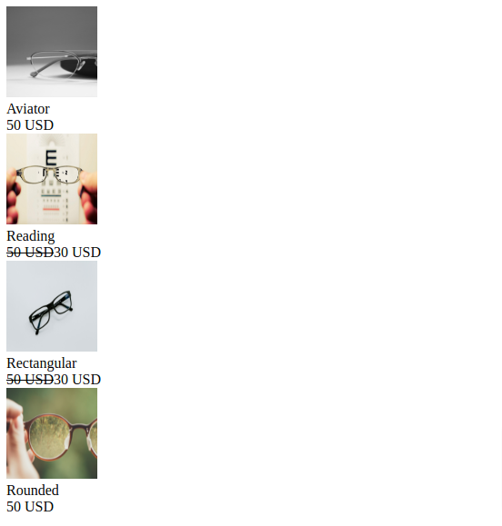

# GlassKart

## Context

GlassKart is a leader in crafting stylish and high-quality, eyewear at affordable prices since 1980. GlassKart operates more than 150+ retail locations across New York, New Jersey, Hartford, Chicago, Los Angeles, San Fransico, Columbus, Washington, Boston and Orlando, and it is also expanding in other cities.​

GlassKart offers a wide variety of fashionable eyewear at various retail outlets. Now, they wish to provide digital shopping experience to mark their presence globally and make the process of buying glasses fun and enjoyable. ​

As a Front end React developer, you are requested to create a web page to display these eye wears at discounted rates as an initial proposal to GlassKart.

### Problem Statement

Create a GlassKart application to display a list of eyewear details with discounted price using ReactJS which resembles the image below.

## Instructions 

1. Download and unzip the boilerplate code.
2. Run the command `npm install` to install the dependencies 
3. Open the boilerplate code in VSCode to develop the assignment solution. 
4. Edit the `index.html` and `src/App.js` file provided in the boilerplate to complete the solution. 
5. Read the instructions given as comments in `index.html` and `src/App.js` **properly** to develop the solution 
6. Run the test scripts available under `src/test` by giving `npm run test` command in the terminal to test locally.
7. Refactor the solution to ensure all test cases are passing. 
8. Zip the solution code with the name same as assignment name. 
9. Upload the zipped solution for submission. 
