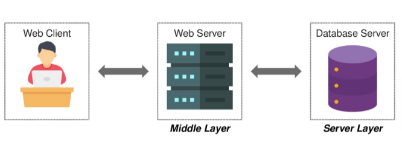

# Manage Application State Using Life Cycle Methods - Journler

## Context

Join millions of Journler users and create a healthier, happier mind. Journler helps increase positive energy and minimize the impact of negative mood swings. 

It facilitates users to be more grateful and have a calmer mind by building healthy thinking through journaling. 

Persistence is "the continuance of an effect after its cause is removed". In the context of storing data in a computer system, this means that the data survives after the process with which it was created has ended. Following image depicts the client-server architecture where data is persisted in a database server. 

 

With persistent data, there is a reasonable confidence that changes will not be lost, and the data will be available later. 

In the previous Journler app challenge exercise, journals which have been added are not available once it is refreshed or reloaded. To make the data persist, use Axios API to store and retrieve the journals in a database server. Implement React life cycle methods for subscribing and unsubscribing asynchronous calls made using Axios.

## Problem Statement

Modify the Journler app created in the previous exercise to make the journal entries persisted using `Axios API` and `json-server`. The functionality listed in the following user stories must be achieved by implementing `React life cycle methods`. Refer to the [Journler Mockup](Journaler.pdf) for functional and UI requirements.

Following are the user stories to be developed:​​

1. As a User, post login, I should be able to add a new Journal item with details such as my mood (excited, happy, sad, angry, surprised), journal date, title, and text.​
2. As a User, post login, I should be able to cancel the addition of a new Journal item.​
3. As a User, post login, I should be able to view existing Journal items.​
4. As a User, post login, I should be able to view aggregated count for each of the moods.​
5. As a User, post login, I should be able to edit selected Journal items.​
6. As a User, post login, I should be able to delete selected Journal items.​
7. As a User, post login, I should be able to cancel the editing of the selected Journal item.​

### Instructions

### Instructions

1. Download and unzip the boilerplate code.  
2. Run the command `npm install` to install the dependencies. 
3. Open the boilerplate code in VSCode to develop the assignment solution.  
4. The Journler application has been created using the `create-react-app` tool.  
5. Edit App, JournalCollection, JournalEditor, JournalViewer and MoodStats components by adding life cycle methods to fulfill the stated requirements.
6. Use db.json file to persist journal entries. The file is already available with one journal item data. 
7. Start the json-server by giving the command `json-server --port 3001 db.json`  
8. Run the test scripts available under `src/test` by giving the `npm run test` command in the terminal to test locally.
9. Refactor the solution to ensure all test cases are passing. 
10. Zip the solution code with the name same as the assignment name.  
11. Upload the zipped solution for submission.
